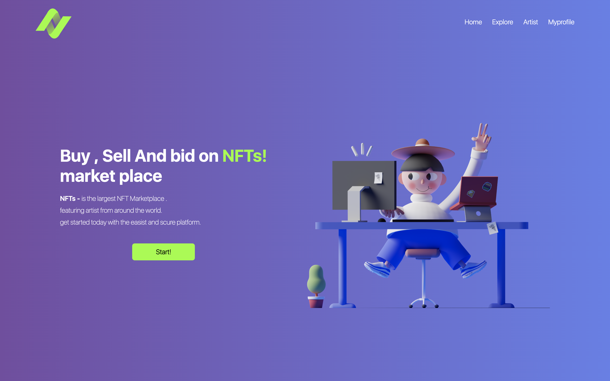

# NFT Bidding Website
This website was my side project during my internship. It Is an NFT(non-fungible token) auction or a bidding website. There is only a Frontend side to this project. With the NFT boom ending i did not bring my self to complete it. 


# Table of Contents
- [Getting started](https://github.com/saleh-kh/NFT-bidding-website#getting-started)
- [Prerequisites](https://github.com/saleh-kh/NFT-bidding-website#prerequisites)
- [Usage](https://github.com/saleh-kh/NFT-bidding-website#usage)
- [Screenshots](https://github.com/saleh-kh/NFT-bidding-website#Screenshots)


# Getting Started
 Clone the repository : 
 ```
git clone https://github.com/saleh-kh/NFT-bidding-website 
```
After cloning the repository. Navigate to the directory of the project and run :
```
npm start
``` 
(make sure all prerequisites are installed)


# Prerequisites
- [Nodejs](https://github.com/nodejs/node)
- [Npm](https://github.com/npm/cli)
- [TailwindCSS](https://github.com/tailwindlabs/tailwindcss)


# Usage
```
npm start
```

# 📸 Screenshots

<p align="center">
<br>
<strong>Homepage</strong>
</p>


<p align="center">
<br>
 <strong>Explore page</strong>
</p>


<p align="center">
<br>
<strong>Explore page 2</strong>
</p>


<p align="center">
<br>
</p>


<p align="center">
<br>
<strong>Signin page</strong>
</p>
